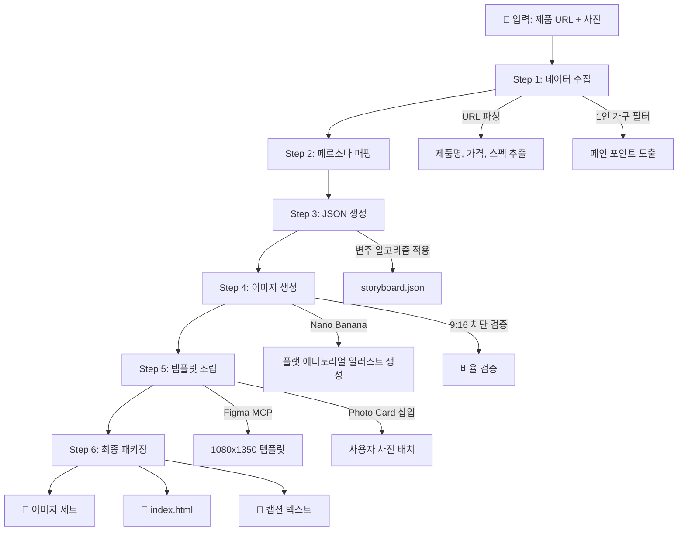

# OpenSpec: 쿠팡 파트너스 미니멀 카드뉴스 자동화 시스템

**프로젝트 코드네임:** The Affairs  
**버전:** 6.5  
**작성일:** 2026-02-23  
**대상 플랫폼:** Instagram Feed (4:5)

---

## 1. 시스템 개요 (System Overview)

### 1.1 목적

쿠팡 파트너스 제휴 링크의 클릭율(CTR)과 계정 팔로우 전환율을 극대화하기 위한 **고감도 매거진 스타일 카드뉴스 자동 생성 파이프라인**을 구축한다. 단순 광고가 아닌 '정보와 감성'을 전달하는 **일인양품** 매거진 포맷을 지향한다.

### 1.2 핵심 가치

| 원칙 | 설명 |
|------|------|
| **Quiet Luxury** | 조용하고 정갈한 프리미엄. 과시가 아닌 절제된 아름다움. |
| **Independent Literary Magazine** | The Affairs(週刊編集) 스타일 — 지적이고 따뜻한 에디토리얼 무드. 볼드 아웃라인의 플랫 일러스트와 크래프트지 질감의 배경이 어우러진 독립 잡지 감성. |
| **Curator, Not Brand** | 우리는 제품을 만드는 브랜드가 아니라 **제품을 발견하고 소개하는 큐레이션 매거진**. 제품에 집중하되, 자사 제품으로 오인되지 않도록 편집자의 시선으로 관찰·추천한다. |
| **Persona-First** | 2040 고감도 1인 가구의 실질적 고민에 공감하는 콘텐츠. |

### 1.3 타겟 페르소나

> **2040 고감도 1인 가구**  
> 좁은 공간을 효율적으로 사용하면서도 심미적 가치를 포기하지 않는 독립 영위자.  
> 번잡한 설명보다 '내 공간에 어울리는가', '내 고단함을 해결하는가'에 집중.

---

## 2. 인터페이스 규격 (Interface Specification)

### 2.1 입력 (Input)

```yaml
input:
  product_url:
    type: string
    required: true
    description: "쿠팡 등 제휴 마케팅 대상 제품 상세 페이지 URL"
    example: "https://www.coupang.com/vp/products/..."

  user_photo:
    type: image
    required: true
    format: "JPEG | PNG"
    dimensions: "1080x1350 (4:5)"
    description: "사용자가 직접 촬영한 제품 실물 사진 1장"
```

### 2.2 출력 (Output)

```yaml
output:
  card_images:
    type: image[]
    count: "5~10장"
    format: "PNG"
    dimensions: "1080x1350 (4:5)"
    description: "완성된 카드뉴스 이미지 세트"

  storyboard_json:
    type: file
    format: "JSON"
    filename: "storyboard.json"
    description: "슬라이드별 텍스트·프롬프트·메타데이터 구조화 데이터"

  web_viewer:
    type: file
    format: "HTML"
    filename: "index.html"
    description: "슬라이더 UI + 구매 버튼 포함 웹 배포용 페이지"

  instagram_caption:
    type: text
    format: "Markdown"
    description: "편집자 톤 캡션 + 해시태그 (인스타그램 게시용)"
```

---

## 3. 슬라이드 아키텍처 (Slide Architecture)

### 3.1 시퀀스 구조

```
┌─────────────────────────────────────────────────────────┐
│  [Slide 1]  HOOK (표지)                                  │
│  ──────────────────────────────────────────────────────  │
│  [Slide 2]  AGITATION (공감)                             │
│  ──────────────────────────────────────────────────────  │
│  [Slide 3~n]  SOLUTION (정보) × 반복                     │
│  ──────────────────────────────────────────────────────  │
│  [Slide n+1]  PHOTO CARD (고정 - 사용자 사진)            │
│  ──────────────────────────────────────────────────────  │
│  [Slide Last]  CTA (구매 전환 + 팔로우 유도)             │
└─────────────────────────────────────────────────────────┘
```

### 3.2 슬라이드 타입별 상세 스펙

#### Slide 1 — Hook (표지)

| 항목 | 규격 |
|------|------|
| **역할** | 1인 가구의 결핍/니즈를 찌르는 헤드라인으로 스크롤 멈춤 유도 |
| **헤드라인** | 1줄, 12~18자 이내 |
| **비주얼** | Noritake 스타일 플랫 일러스트 — 머리카락만 솔리드 블랙 필, 나머지 아웃라인만 (제품 실루엣 또는 공간 상징) |
| **레이아웃** | 좌측 35~45% 텍스트 / 우측·하단 비주얼 |
| **여백** | 전체 면적 50% 이상 |

**헤드라인 작성 패턴:**
```
"퇴근 후, [상황의 불편함]"
"혼자 사니까, [결핍 포인트]"
"[공간/시간]이 달라지는 순간"
```

##### 🔒 Hook 슬라이드 고정 레이아웃 가이드라인 (The Affairs Cover Style)

> [!IMPORTANT]
> 아래 레이아웃은 The Affairs(週刊編集) VOL.002 표지 구조를 1080×1350 캔버스에 정밀 매핑한 것입니다.
> **모든 카드뉴스의 첫 페이지(Hook)는 이 구조를 고정 템플릿으로 사용합니다.**

**캔버스 전체 구조 (4-Zone System):**

```
┌──────────────────────────────────────────────┐
│  ZONE A — HEADER BAR                         │
│  (y: 0~175px, 약 13%)                        │
│  ┌──────────────────────────┬──────────────┐  │
│  │ 좌: 매거진 로고 + 태그라인 │ 우: VOL/날짜  │  │
│  │ 1iN 일인양품 (로고 PNG)   │ "VOL.XXX"    │  │
│  │ 작은 인용구/서브카피      │              │  │
│  └──────────────────────────┴──────────────┘  │
├──────────────────────────────────────────────┤
│  ZONE B — MAIN ILLUSTRATION                  │
│  (y: 175~1020px, 약 63%)                     │
│                                              │
│     ┌─────────────────────┐                  │
│     │                     │                  │
│     │   플랫 에디토리얼     │   ZONE C 영역   │
│     │   일러스트            │   (우측 배치)   │
│     │   (중앙~좌측 배치)    │                 │
│     │   캔버스 폭 50~65%   │  ┌───────────┐  │
│     │                     │  │ 헤드라인    │  │
│     │                     │  │ (대형 세리프)│  │
│     └─────────────────────┘  │            │  │
│                              │ 서브카피    │  │
│                              │ 2~3줄      │  │
│                              └───────────┘  │
├──────────────────────────────────────────────┤
│  ZONE D — FOOTER BAR                         │
│  (y: 1020~1350px, 약 24%)                    │
│  ┌────┬────┬────┬────┬────┐                  │
│  │칼럼1│칼럼2│칼럼3│칼럼4│칼럼5│ ← 목차형 구격  │
│  └────┴────┴────┴────┴────┘                  │
│  하단 가느다란 정보 바                          │
└──────────────────────────────────────────────┘
```

**ZONE A — Header Bar (상단 매거진 헤더 영역)**

| 항목 | 규격 |
|------|------|
| **높이** | 0 ~ 175px (캔버스 상위 약 13%) |
| **배경** | 메인 배경과 동일 또는 미세하게 다른 톤 (핑크, 크래프트지 중 택일) |
| **좌측 요소** | `1iN 일인양품` 로고 이미지 — 투명 배경 PNG, 폭 60~80px |
| **좌측 하위** | 짧은 인용구 또는 태그라인 — Inter Italic, 10~12pt, #333 |
| **우측 요소** | `VOL.XXX` 또는 날짜 — Inter SemiBold, 11pt, 우측 정렬 |
| **구분선** | 없음. 여백으로 Zone B와 자연 분리 |

**ZONE B — Main Illustration (중앙 일러스트 영역)**

| 항목 | 규격 |
|------|------|
| **높이** | 175 ~ 1020px (캔버스 중앙 약 63%) |
| **일러스트 위치** | 중앙 또는 약간 좌측으로 치우침 (캔버스 폭의 50~65% 점유) |
| **일러스트 스타일** | Noritake 스타일 — 균일 아웃라인, 머리카락만 솔리드 블랙 필, 나머지 아웃라인만 (§4.3 참조) |
| **인물/사물** | 1~2개 주요 오브젝트. 과밀 금지 — 호흡 공간 확보 |
| **일러스트 하단** | 캔버스 바닥에 닿지 않음 — Zone D와 최소 30px 여백 |
| **배경과의 관계** | 일러스트가 배경 위에 직접 배치 (별도 프레임/박스 없음) |

**ZONE C — Headline Block (우측 텍스트 영역, Zone B에 오버레이)**

| 항목 | 규격 |
|------|------|
| **위치** | 우측 정렬, 캔버스 우측 35~45% 영역 |
| **수직 위치** | 캔버스 높이 50~70% 구간 (일러스트 중하단과 나란히) |
| **헤드라인** | NanumSquare ExtraBold 또는 세리프 계열, 36~48pt, `#000` |
| **서브카피** | 2~3줄, NanumSquare Regular, 12~14pt, `#333` |
| **줄 간격** | 헤드라인 1.2em / 서브카피 1.6em |
| **정렬** | 좌측 정렬 (Zone C 내부 기준) |
| **일러스트와의 관계** | 겹치지 않거나, 겹쳐도 텍스트 가독성 확보 (여백 버퍼 최소 20px) |

**ZONE D — Footer Bar (하단 목차/정보 영역)**

| 항목 | 규격 |
|------|------|
| **높이** | 1020 ~ 1350px (캔버스 하위 약 24%) |
| **구조** | 4~5칼럼 그리드, 목차(Table of Contents) 스타일 |
| **칼럼 내용** | 각 칼럼에 "슬라이드 미리보기 제목" 또는 제품 키워드 요약 |
| **폰트** | 제목: NanumSquare Bold, 11~13pt / 설명: Regular, 9~10pt |
| **구분** | 칼럼 간 세로 구분선 없음, 간격으로 분리 (칼럼 간 16~20px) |
| **최하단** | 가느다란 정보 바 — 매거진 URL, 발행 정보 등 (Inter Light, 8pt) |
| **역할** | 카드뉴스 다음 슬라이드로의 기대감 유도 + 매거진 정체성 강화 |

**Hook 고정 레이아웃 체크리스트 ✅**

- [ ] Zone A에 `1iN 일인양품` 매거진 로고 이미지(60~80px)가 좌측 상단에 고정 배치되었는가?
- [ ] 메인 일러스트가 캔버스 중앙~좌측을 차지하며, 우측에 텍스트 공간이 확보되었는가?
- [ ] 헤드라인이 우측 영역에 36pt 이상으로 배치되었는가?
- [ ] 서브카피가 헤드라인 아래 2~3줄 이내로 배치되었는가?
- [ ] 하단 Footer가 목차 스타일로 4~5칼럼 구격을 갖추었는가?
- [ ] 배경색이 The Affairs 톤(크래프트지/웜 핑크/순백 중 택일)인가?
- [ ] 전체 여백이 면적의 40% 이상 확보되었는가?

#### Slide 2 — Agitation (공감)

| 항목 | 규격 |
|------|------|
| **역할** | 일상적 불편함을 구체적 장면으로 묘사하여 깊은 공감 유도 |
| **텍스트** | 포인트 문구 2~3줄 (각 줄 12~18자) |
| **비주얼** | 1인 가구 일상 장면의 Noritake 스타일 플랫 일러스트 (머리카락만 솔리드 필, 나머지 아웃라인만) |
| **톤** | 설교가 아닌, 관찰자 시점의 담백한 서술 |

#### Slide 3~n — Solution (정보)

| 항목 | 규격 |
|------|------|
| **역할** | 제품 기능을 1인 가구 라이프스타일에 매핑하여 정보 전달 |
| **구성** | 슬라이드당 핵심 포인트 1개 집중 |
| **텍스트** | 헤드라인 1줄 + 포인트 문구 1~2줄 |
| **비주얼** | 플랫 에디토리얼 일러스트 기반 사용 장면 (The Affairs 스타일) |
| **변주** | 매 슬라이드마다 구도·소재 교차 적용 (§4.3 참조) |

#### Slide (Last-1) — Photo Card (고정)

| 항목 | 규격 |
|------|------|
| **역할** | 실물 사진으로 신뢰감 전달, 구매 직전 확신 제공 |
| **이미지** | **사용자 첨부 사진 원본 사용** (AI 생성 금지) |
| **배경** | 없음 — 사진 자체가 전체 캔버스를 채움 |
| **오버레이 텍스트** | 제품명 + 가격 **only** (추가 카피 금지) |
| **텍스트 위치** | 하단 좌측, 반투명 배경 위 |
| **폰트** | 제품명: NanumSquare Bold / 가격: Inter SemiBold |

#### Slide Last — CTA (마지막 장)

| 항목 | 규격 |
|------|------|
| **역할** | 구매 전환 + 계정 팔로우 유도 |
| **고정 문구** | "자세한 정보는 프로필 링크에서" |
| **부제** | "일인양품 리스트에서 확인하세요" |
| **버튼 텍스트** | "구매 링크 보기" (웹 버전에서 클릭 가능) |
| **디자인** | 미니멀 CTA — 중앙 정렬, 충분한 여백 |

---

## 4. 시각 디자인 시스템 (Visual Design System)

### 4.1 절대 규칙 ⛔

> [!CAUTION]
> 아래 규칙은 어떤 상황에서도 위반 불가합니다.

| # | 규칙 | 위반 시 |
|---|------|---------|
| 1 | **캔버스 비율: 4:5 (1080×1350) ONLY** | 9:16 생성 시 전체 재작업 |
| 2 | **이미지 프롬프트 강제 미주:** 모든 프롬프트 끝에 `"Instagram FEED canvas only, 1080x1350, aspect ratio 4:5. DO NOT generate 9:16."` 필수 삽입 | 누락 시 비율 이탈 위험 |
| 3 | **브랜드 요소 금지:** 실제 로고·상표·패키지 재현 금지 (무지/placeholder 처리) | 저작권 리스크 |
| 4 | **과장 표현 금지:** "최고", "혁명", "완벽" 등 사용 금지 | 톤 붕괴 |
| 5 | **큐레이션 정체성:** 우리는 제품 제조사가 아닌 **큐레이션 매거진**. "우리 제품", "자체 개발" 등 자사 브랜드 제품으로 오인될 표현 금지. 반드시 **편집자가 발견·추천하는 관찰자 톤** 유지 | 브랜드 오인 → 신뢰도 하락 |
| 6 | **글로벌 로고 배치:** 모든 슬라이드 좌측 상단에 `1iN 일인양품` 로고 고정 배치 (아래 상세 규격 참조) | 누락 시 브랜드 아이덴티티 부재 |

#### 글로벌 로고 배치 규격 (모든 슬라이드 공통)

| 항목 | 규격 |
|------|------|
| **위치** | 좌측 상단 고정 (x: 24px, y: 24px) |
| **크기** | 폭 60~80px (캔버스 폭의 약 5.5~7.5%) — 존재감은 있되 겸손한 크기 |
| **색상 자동 전환** | 배경 #C4A882 → **화이트 로고** / 배경 #FFFFFF → **크래프트 골드 로고** |
| **Photo Card 예외** | 실물 사진 위 → 화이트 로고 (가독성 우선) |
| **투명도** | 100% 불투명 (반투명 금지) |
| **로고 파일** | 투명 배경 PNG 사용 (로고 3종 중 투명 배경 버전) |
| **역할** | 큐레이션 매거진 아이덴티티 표시 (제품 브랜드가 아닌 매거진 마크) |

#### 로고 에셋 관리 규칙

```
assets/
├── logo/
│   ├── 1in_logo_white.png        ← 크래프트지/어두운 배경용 (화이트 로고)
│   ├── 1in_logo_kraft.png        ← 순백 배경용 (크래프트 골드 로고)
│   └── 1in_logo_bg_kraft.png     ← 크래프트지 배경 포함 버전 (프로필용)
```

| 항목 | 규격 |
|------|------|
| **파일 형식** | PNG, 투명 배경 (logo_white, logo_kraft) |
| **해상도** | 원본 @2x (160px 폭 기준), 배치 시 60~80px로 축소 |
| **네이밍** | `1in_logo_{color_variant}.png` |

### 4.2 컬러 시스템

```yaml
color_system:
  background:
    primary: "#C4A882"     # 크래프트지/웜 오커 (The Affairs 시그니처 톤)
    secondary: "#FFFFFF"   # 순백 (변주용)
    tertiary: "#E5D3B3"   # 라이트 베이지 (중간 톤)
    usage: "크래프트지 톤 기본, 순백과 교차 적용"

  text:
    primary: "#000000"     # 헤드라인, 일러스트 아웃라인/필
    secondary: "#333333"   # 본문, 부제
    muted: "#666666"       # 보조 정보 (가격 등)

  accent:
    illustration_stroke: "#000000"    # 균일 아웃라인 스트로크
    illustration_fill: "#000000"      # 솔리드 블랙 필 (머리카락 ONLY)
    overlay_bg: "rgba(0, 0, 0, 0.45)"  # Photo Card 텍스트 배경
```

### 4.3 캐릭터 화풍 가이드라인 (LOCKED 🔒 — Noritake Style)

> [!IMPORTANT]
> 아래 화풍은 모든 슬라이드의 인물·사물 일러스트에 고정 적용됩니다.
> Noritake(ノリタケ) 스타일의 일본 에디토리얼 일러스트를 기반으로 합니다.

#### 4.3.1 선(Line) 규칙

| 항목 | 규격 |
|------|------|
| **선 굵기** | 균일한 중간 굵기 (약 2.5~3.5pt), 전체 일러스트에서 단일 두께 유지 |
| **선 색상** | `#000000` 순흑 Only |
| **선 끝 처리** | 라운드 캡 (둥근 마감), 날카로운 각진 끝 금지 |
| **선 강약** | 없음 — 붓 느낌의 강약 변화 금지. 처음부터 끝까지 동일한 굵기 |
| **교차선** | 깔끔한 연결, 겹침 없음 |

#### 4.3.2 채움(Fill) 규칙

| 부위 | 처리 방식 |
|------|----------|
| **머리카락** | ✅ **솔리드 블랙 필** — 유일하게 면 채움이 들어가는 부위 |
| **의복 (상의/하의)** | ❌ 아웃라인만 — 내부는 배경색 노출 (채움 없음) |
| **피부/신체** | ❌ 아웃라인만 — 내부는 배경색 노출 |
| **신발** | ❌ 아웃라인만 (또는 하의와 동일 처리) |
| **소품/사물** | ❌ 아웃라인만 — 컵, 그릇, 가구 등 모두 윤곽선으로만 표현 |
| **그림자** | ❌ 없음 — 드롭 섀도우, 캐스트 섀도우 금지 |

> [!CAUTION]
> **머리카락 외 솔리드 블랙 필 금지.** 의복에 블랙 필이 들어가면 Noritake 스타일이 무너집니다.
> 줄무늬(스트라이프) 패턴은 아웃라인 선으로 표현 가능 (솔리드 필과 다름).

#### 4.3.3 얼굴 표현 규칙

```
┌────────────────────────────────┐
│           ◆ 머리카락            │
│         (솔리드 블랙 필)         │
│  ┌──────────────────────────┐  │
│  │                          │  │
│  │    ·        ·            │  │  ← 눈: 작은 점 (2~3px) 또는 짧은 곡선
│  │                          │  │
│  │         ╲                │  │  ← 코: 작은 삼각형 또는 짧은 꺽쇠선
│  │                          │  │
│  │                          │  │  ← 입: 없음 (기본) 또는 매우 짧은 가로선
│  │     ⟋            ⟍      │  │  ← 귀: 단순 C자 곡선
│  └──────────────────────────┘  │
└────────────────────────────────┘
```

| 부위 | 표현 | 금지 |
|------|------|------|
| **눈** | 작은 점(·) 또는 짧은 곡선. 좌우 대칭 | 동그란 원, 속눈썹, 하이라이트, 큰 눈 |
| **코** | 작은 삼각형 범프 또는 "ㄱ" 형태의 옆선 | 콧구멍 표현, 사실적 코 |
| **입** | 기본적으로 없음. 필요 시 짧은 수평선(-) | 웃는 입, 이빨, 혀, 립스틱 |
| **귀** | 단순 C자 또는 반원, 머리카락에 가려질 수 있음 | 귓속 디테일 |
| **표정** | 무표정~담담. 감정은 **자세와 동작**으로 표현 | 과장된 감정, 이모티콘 느낌 |

#### 4.3.4 신체 비례 및 자세

| 항목 | 규격 |
|------|------|
| **등신** | 5~6등신 (약간 큰 머리, 자연스러운 비율) |
| **체형** | 보통 체형, 과도한 마름/뚱뚱 표현 없음. 성별 무관하게 담백한 실루엣 |
| **어깨** | 약간 둥글게, 힘이 빠진 자연스러운 각도 |
| **손** | 단순화되었지만 기능적 — 물건을 잡을 수 있는 정도. 손가락 3~4개로 간략화 가능 |
| **자세** | 일상적 동작 (앉기, 서기, 마시기, 먹기 등). 과장된 포즈 금지 |
| **동작 표현** | 정적이고 고요한 순간을 포착. 달리기·점프 등 격한 동작 금지 |

#### 4.3.5 사물/소품 표현 규칙

| 항목 | 규격 |
|------|------|
| **선 굵기** | 캐릭터와 동일한 굵기 유지 |
| **디테일 수준** | 본질적 형태만 남기고 단순화 (컵 = 원기둥, 젓가락 = 두 직선 등) |
| **채움** | 아웃라인만 — 솔리드 필 금지 |
| **질감/패턴** | 선으로만 표현 가능 (줄무늬 = 평행선, 나무 결 = 곡선 등) |
| **크기감** | 캐릭터와 자연스러운 비례 유지 |

#### 4.3.6 제품(Product) 표현 가이드라인

> [!IMPORTANT]
> 카드뉴스의 목적은 **제품 소개 → 구매 전환**입니다.
> 제품은 Noritake 화풍을 유지하면서도 **인식 가능**하게 그려야 합니다.

**기본 원칙:**

| 항목 | 규격 |
|------|------|
| **화풍 일관성** | 캐릭터·배경과 동일한 Noritake 스타일 (균일 아웃라인, 채움 없음) |
| **디테일 수준** | 캐릭터보다 **한 단계 더 구체적** — 제품의 핵심 형태적 특징이 인식 가능해야 함 |
| **채움** | ❌ 아웃라인만 — 솔리드 블랙 필 금지 (머리카락 규칙과 동일) |
| **브랜드 표시** | ❌ 로고·상표·패키지 문자 일절 금지 → 무지 placeholder 처리 |
| **크기** | 슬라이드 내 시각적 비중 30~50% (지배하지도, 묻히지도 않는 수준) |

**슬라이드별 제품 표현 방식:**

| 슬라이드 | 표현 방식 | 설명 |
|---------|----------|------|
| **Hook (표지)** | **실루엣 암시** | 제품 전체를 보여주지 않음. 일부(상단, 모서리, 그림자 윤곽)만 등장하여 호기심 유도. 캐릭터와 함께 또는 캐릭터 옆 배치 |
| **Agitation (공감)** | **부재 또는 간접 표현** | 제품이 없는 상태의 불편함을 보여줌. 제품 자체보다 문제 상황을 시각화 |
| **Solution (정보)** | **사용 맥락에서 노출** | 캐릭터가 실제로 제품을 사용하는 장면. 제품의 핵심 기능이 시각적으로 드러나야 함 |
| **Photo Card** | **실물 사진** | AI 일러스트 아님 — 사용자 첨부 사진 원본 사용 |
| **CTA** | **아이콘 수준** | 제품 전체 형태를 극도로 단순화한 아이콘(10선 이내) |

**제품 카테고리별 디테일 힌트:**

| 카테고리 | 인식 가능하게 꼭 그려야 할 핵심 형태 | 생략 가능한 부분 |
|---------|-------------------------------|--------------|
| **가전/전자** | 전체 실루엣 + 버튼/손잡이 위치 | 디스플레이 내용, 작은 포트 |
| **주방용품** | 손잡이 형태 + 용기 비율 | 표면 질감, 눈금선 |
| **가구** | 전체 프레임 + 다리/서랍 구조 | 나무/금속 재질 표현 |
| **생활소품** | 고유 형태 + 사용 방식이 드러나는 각도 | 라벨, 표면 패턴 |
| **식품/음료** | 용기/패키지 실루엣 (내용물보다 외형) | 성분표, 작은 텍스트 |

**제품 일러스트 구도 규칙:**

```
┌────────────────────────────────────┐
│                                    │
│   ┌──────┐                         │
│   │ 제품  │  ← 단독 배치 시:        │
│   │      │    중앙 또는 우측 하단    │
│   └──────┘    여백 40% 이상 확보     │
│                                    │
├────────────────────────────────────┤
│                                    │
│   👤 ────── 🔲  ← 사용 장면 시:     │
│   캐릭터    제품    캐릭터가 직접     │
│                   제품을 들거나      │
│                   사용하는 모습      │
│                                    │
└────────────────────────────────────┘
```

| 구도 | 설명 |
|------|------|
| **캐릭터 + 제품** | 캐릭터가 제품을 잡고/사용하는 장면. 제품이 손에 자연스럽게 위치 |
| **제품 단독** | 제품만 중앙~우측에 배치. 주변에 충분한 여백. 텍스트 공간 확보 |
| **환경 속 제품** | 테이블 위, 선반 위 등 생활 공간에 놓인 제품. 맥락 전달 |

#### 4.3.7 화풍 체크리스트 ✅

- [ ] 머리카락만 솔리드 블랙 필이고, 나머지는 모두 아웃라인만인가?
- [ ] 선 굵기가 전체 일러스트에서 균일한가?
- [ ] 얼굴이 극도로 미니멀(점 눈, 작은 코, 입 없음)한가?
- [ ] 그림자/음영 효과가 없는가?
- [ ] 캐릭터 자세가 정적이고 일상적인가?
- [ ] 소품도 아웃라인만으로 처리되었는가?
- [ ] 배경과 일러스트 사이 색상이 2톤(흑+배경)인가?
- [ ] **제품이 아웃라인만으로 그려졌으며, 핵심 형태가 인식 가능한가?**
- [ ] **제품에 실제 브랜드 로고/상표/텍스트가 없는가?**
- [ ] **제품의 슬라이드별 표현 방식(실루엣→사용장면→실물사진)이 지켜졌는가?**

---

### 4.4 타이포그래피 (LOCKED 🔒)

```yaml
typography:
  korean:
    family: "NanumSquare"
    weights: [Regular, Bold, ExtraBold]
    fallback: "sans-serif"

  english:
    family: "Inter"
    weights: [Regular, SemiBold, Bold]
    fallback: "sans-serif"

  alignment: "left"           # 좌측 정렬 고정
  color: "#000 | #333"        # 2색 택일

  constraints:
    headline:
      lines: 1
      chars_per_line: "12~18자"
    body:
      lines: "최대 3줄"
      chars_per_line: "12~18자"
```

### 4.5 그리드 레이아웃

```
┌──────────────────────────────────────┐
│  ┌────────────┬─────────────────────┐ │
│  │            │                     │ │
│  │  TEXT ZONE │   VISUAL ZONE       │ │
│  │  (35~45%)  │   (55~65%)          │ │
│  │            │                     │ │
│  │  · 헤드라인 │   · 플랫 일러스트     │ │
│  │  · 포인트   │   · 에디토리얼 비주얼  │ │
│  │  · 부제    │   · 소재 텍스처      │ │
│  │            │                     │ │
│  └────────────┴─────────────────────┘ │
│                                      │
│  ▓▓▓▓▓▓▓ 여백 50%+ ▓▓▓▓▓▓▓           │
└──────────────────────────────────────┘
```

### 4.6 텍스트 배치 패턴 (Text Layout Patterns)

> [!IMPORTANT]
> 아래 3가지 패턴을 Solution 슬라이드에서 **순환 적용**하여 단조로움을 방지합니다.
> 동일 패턴이 2장 연속 사용되어서는 안 됩니다.

#### 패턴 A — 세로 포인트 키워드 (Vertical Keyword)

핵심 키워드 1개를 세로로 크게 배치하여 시선을 잡는 레이아웃.

```
┌──────────────────────────────────┐
│                                  │
│                          조      │  ← 세로 키워드
│   [Noritake 일러스트]     용      │     NanumSquare ExtraBold
│   (캐릭터+제품 사용장면)   한      │     36~48pt, #000
│                          부      │     우측 배치, 상하 중앙 정렬
│                          엌      │
│                                  │
│   서브카피 1줄 (가로)             │  ← 하단 또는 일러스트 아래
│                                  │     NanumSquare Regular, 12pt
└──────────────────────────────────┘
```

| 항목 | 규격 |
|------|------|
| **세로 키워드** | 2~5글자, NanumSquare ExtraBold, 36~48pt |
| **키워드 위치** | 캔버스 우측 10~20% 영역, 수직 중앙 정렬 |
| **서브카피** | 가로 1줄, 12~14pt, 하단 배치 |
| **일러스트 위치** | 좌측~중앙 (캔버스 폭 50~65%) |
| **적합 슬라이드** | Solution — 제품 기능 키워드 강조 |

#### 패턴 B — 세로 + 가로 혼합 (Mixed Vertical-Horizontal)

좌측에 세로 제목, 우측에 가로 서브카피와 일러스트를 배치하는 레이아웃.

```
┌──────────────────────────────────┐
│                                  │
│  퇴  │                           │
│  근  │   가로 서브카피 1~2줄       │  ← NanumSquare Regular
│  후  │   "나를 위한 시간을          │     12~14pt, #333
│  의  │    조용히 만들어주는 것"      │
│  3   │                           │
│  0   │   [Noritake 일러스트]       │
│  분  │   (사용 장면)               │
│      │                           │
└──────────────────────────────────┘
```

| 항목 | 규격 |
|------|------|
| **세로 제목** | 좌측 10~15% 영역, NanumSquare Bold, 28~36pt |
| **가로 서브카피** | 우측 상단, 1~2줄, 12~14pt |
| **일러스트** | 우측 중하단, 캔버스 폭 55~70% |
| **구분** | 세로 텍스트와 우측 영역 사이 여백(20~30px)으로 분리, 구분선 없음 |
| **적합 슬라이드** | 감성적 키워드 + 제품 사용 장면 조합 |

#### 패턴 C — 정보 스트립 바 (Information Strip)

상단에 일러스트, 하단에 제품 스펙을 칼럼형으로 정리하는 레이아웃.

```
┌──────────────────────────────────┐
│                                  │
│   헤드라인 (가로, 좌측 정렬)       │  ← NanumSquare Bold, 20~28pt
│                                  │
│   [Noritake 일러스트]             │
│   (캐릭터+제품 사용장면)           │
│                                  │
├──────────────────────────────────┤  ← 얇은 구분선(0.5pt) 또는 여백
│                                  │
│  포인트 1   │  포인트 2  │ 포인트 3 │  ← 3칼럼 균등 분할
│  용량       │  소재      │  무게    │     Bold 11pt + Regular 10pt
│  500ml     │  스테인리스  │  380g   │
│                                  │
└──────────────────────────────────┘
```

| 항목 | 규격 |
|------|------|
| **상단 영역** | 캔버스 상위 70% — 헤드라인 + 일러스트 |
| **하단 스트립** | 캔버스 하위 25~30%, 3칼럼 균등 분할 |
| **칼럼 구분** | 간격(16~20px)으로 분리, 세로선 없음 |
| **칼럼 내용** | 라벨(Bold) + 값(Regular). 제품 핵심 스펙 3가지 |
| **적합 슬라이드** | Solution — 스펙/수치 정보 전달 |

---

### 4.7 통합 변주 규칙 (Anti-Monotony System)

Solution 슬라이드(3~n)에서 지루함 방지를 위해 **4개 변주 축을 동시 순환:**

#### 변주 축 풀

| 변주 축 | 옵션 풀 |
|---------|---------|
| **텍스트 배치** | ⓐ 세로 키워드 → ⓑ 세로+가로 혼합 → ⓒ 정보 스트립 |
| **일러스트 구도** | ① 우측 하단 배치 → ② 중앙 집중 → ③ 3/4 측면뷰 → ④ 타이트 디테일 크롭 |
| **배경색** | #C4A882 (크래프트지) ↔ #FFFFFF (순백) 교차 |
| **제품 표현** | 캐릭터+제품 → 제품 단독 → 환경 속 제품 |

#### 연속 반복 금지 규칙

> [!CAUTION]
> 아래 규칙은 모든 Solution 슬라이드 생성 시 강제 적용됩니다.

| 규칙 | 설명 |
|------|------|
| **텍스트 패턴 연속 금지** | 같은 텍스트 배치 패턴(A/B/C)이 2장 연속 사용 불가 |
| **배경색 3연속 금지** | 동일 배경색이 3장 연속 사용 불가 |
| **구도 연속 금지** | 같은 일러스트 구도가 2장 연속 사용 불가 |
| **최소 변주 보장** | 인접한 2장의 슬라이드는 최소 2개 축 이상 차이 |

#### 적용 알고리즘

```python
TEXT_POOL     = ["vertical_keyword", "mixed_vh", "info_strip"]  # A, B, C
COMP_POOL     = ["lower_right", "center", "three_quarter", "detail_crop"]
BG_POOL       = ["#C4A882", "#FFFFFF"]
PRODUCT_POOL  = ["with_character", "standalone", "in_environment"]

for each solution_slide[i]:
    text_layout   = TEXT_POOL[i % 3]
    composition   = COMP_POOL[i % 4]
    background    = BG_POOL[i % 2]
    product_style = PRODUCT_POOL[i % 3]

    # 연속 반복 검증
    if i > 0:
        assert text_layout   != prev_text_layout     # 텍스트 패턴 연속 금지
        assert composition   != prev_composition     # 구도 연속 금지
        diff_count = count_differences(current, previous)
        assert diff_count >= 2                        # 최소 2축 차이
```

#### 예시: 5장 Solution 슬라이드 변주 매핑

| Slide | 텍스트 배치 | 구도 | 배경 | 제품 표현 |
|-------|-----------|------|------|---------|
| **S3** | ⓐ 세로 키워드 | ① 우측 하단 | #C4A882 | 캐릭터+제품 |
| **S4** | ⓑ 세로+가로 | ② 중앙 | #FFFFFF | 제품 단독 |
| **S5** | ⓒ 정보 스트립 | ③ 3/4 측면 | #C4A882 | 환경 속 제품 |
| **S6** | ⓐ 세로 키워드 | ④ 디테일 크롭 | #FFFFFF | 캐릭터+제품 |
| **S7** | ⓑ 세로+가로 | ① 우측 하단 | #C4A882 | 제품 단독 |

---

## 5. 이미지 생성 프롬프트 규격 (Image Prompt Spec)

### 5.1 스타일 레퍼런스

> **Noritake × The Affairs 에디토리얼 일러스트 스타일**  
> 균일한 중간 굵기의 블랙 아웃라인으로 그린 미니멀 플랫 일러스트.  
> **머리카락만 솔리드 블랙 필**, 의복·신체·소품은 아웃라인만(내부 채움 없음).  
> 극도로 단순한 얼굴(점 눈, 작은 코, 입 없음), 정적이고 담담한 일상 장면.  
> 크래프트지/웜 베이지 배경 위 2톤(흑+배경) 구성, 독립 문학잡지 무드.

### 5.2 공통 프롬프트 구조

```
[STYLE_PREFIX] + [SCENE_DESCRIPTION] + [COMPOSITION] + [MATERIAL_TEXTURE] + [RATIO_SUFFIX]
```

#### 구성 요소별 정의:

```yaml
STYLE_PREFIX: >
  Noritake-style flat editorial illustration, uniform medium-weight
  black outlines on {background_color} background. Hair is the ONLY
  solid black filled area. Body, clothing, and all objects are outlined
  only with no fill — background color shows through. Minimal face:
  dot eyes, tiny nose, no mouth. Calm everyday pose, static and quiet.
  Two-tone palette (black + background only), no gradients, no shadows.
  Independent literary magazine aesthetic, generous whitespace.

SCENE_DESCRIPTION: >
  {슬라이드별 장면 묘사 — 1인 가구 맥락}

COMPOSITION: >
  {변주 풀에서 선택된 구도 지시어}

MATERIAL_TEXTURE: >
  {변주 풀에서 선택된 소재감, e.g. "on marble surface, soft diffused light"}

RATIO_SUFFIX: >
  Instagram FEED canvas only, 1080x1350, aspect ratio 4:5.
  DO NOT generate 9:16.
```

### 5.3 스타일 키워드 치트시트 (LOCKED 🔒)

| 카테고리 | ✅ 사용 키워드 | ❌ 금지 키워드 |
|---------|--------------|---------------|
| **스타일** | Noritake-style, flat editorial illustration, uniform outlines | bold heavy outlines, varying line weight, sketch, hatching |
| **채움** | hair only solid black fill, outlined body, two-tone | all-black clothing, filled clothing, multicolor, gradient fills |
| **얼굴** | dot eyes, tiny nose, no mouth, minimal face | big eyes, detailed face, eyelashes, lips, eyebrows |
| **무드** | calm, quiet moment, everyday life, static pose | dynamic action, running, jumping, dramatic |
| **배경** | warm kraft paper, warm beige, clean white | neon, gradient, textured background, pattern |
| **그림자** | no shadow, no shading, flat | drop shadow, cast shadow, ambient occlusion |
| **소품** | outlined objects, simplified shapes | detailed realistic objects, filled objects |

### 5.4 슬라이드 타입별 프롬프트 예시

**Hook (표지):**
```
Noritake-style flat editorial illustration.
Uniform medium-weight black outlines on warm kraft paper (#C4A882).
A calm person standing next to {product_silhouette}.
Hair is solid black fill, body and clothing are outlined only
with no fill (background shows through). Minimal face: dot eyes,
tiny nose, no mouth. Quiet, still moment.
Generous whitespace, independent literary magazine feel.
Instagram FEED canvas only, 1080x1350, aspect ratio 4:5.
DO NOT generate 9:16.
```

**Agitation (공감):**
```
Noritake-style flat editorial illustration.
Uniform medium-weight black outlines on white (#FFFFFF) background.
A lone figure in a small apartment kitchen, {agitation_scene_description}.
Hair is solid black fill, everything else is outlined only, no fill.
Minimal face (dot eyes, tiny nose, no mouth).
Emotion expressed through posture, not face. Calm, quiet mood.
Generous whitespace, literary magazine aesthetic.
Instagram FEED canvas only, 1080x1350, aspect ratio 4:5.
DO NOT generate 9:16.
```

**Solution (정보):**
```
Noritake-style flat editorial illustration.
Uniform medium-weight black outlines on warm kraft paper (#C4A882).
A person in a compact apartment using {product_function_scene}.
Hair is solid black fill. Body, clothing, and all objects are outlined
only — no fill, no shadow. Minimal face: dot eyes, tiny nose, no mouth.
Everyday quiet moment, static pose. composition: {변주 구도}.
Generous whitespace, independent literary magazine feel.
Instagram FEED canvas only, 1080x1350, aspect ratio 4:5.
DO NOT generate 9:16.
```

**Photo Card:** AI 이미지 생성 없음 — 사용자 첨부 사진 직접 사용.

**CTA (마지막 장):**
```
Minimal clean editorial design, warm kraft paper background (#C4A882),
centered text layout, generous whitespace.
Small Noritake-style icon (uniform outline, hair-only black fill)
as a subtle accent. Literary magazine feel.
Instagram FEED canvas only, 1080x1350, aspect ratio 4:5.
DO NOT generate 9:16.
```

---

## 6. 데이터 스키마 (storyboard.json)

```jsonc
{
  "project": "the-affairs",
  "version": "6.0",
  "product": {
    "name": "제품명",
    "price": "₩XX,XXX",
    "url": "https://...",
    "affiliate_url": "https://link.coupang.com/...",
    "specs": ["스펙1", "스펙2"],
    "pain_points": ["1인 가구 페인포인트 1", "..."]
  },
  "slides": [
    {
      "index": 1,
      "type": "hook",
      "headline": "퇴근 후, 조용히 무너지는 저녁",
      "body": null,
      "image_prompt": "Noritake-style flat editorial illustration, uniform outlines on #FFFFFF...",
      "background": "#FFFFFF",
      "composition": "lower-right",
      "material": "marble",
      "layout": {
        "text_zone_ratio": 0.40,
        "text_align": "left"
      }
    },
    {
      "index": 2,
      "type": "agitation",
      "headline": "매일 반복되는 그 장면",
      "body": ["설거지 위에 쌓이는 설거지", "좁은 싱크대와의 전쟁"],
      "image_prompt": "Noritake-style flat editorial illustration, uniform outlines on #E5D3B3...",
      "background": "#E5D3B3",
      "composition": "center",
      "material": "glass",
      "layout": {
        "text_zone_ratio": 0.40,
        "text_align": "left"
      }
    },
    // ... Solution slides (type: "solution")
    {
      "index": "n+1",
      "type": "photo_card",
      "headline": null,
      "body": null,
      "image_prompt": null,
      "user_photo": true,
      "overlay": {
        "product_name": "제품명",
        "price": "₩XX,XXX",
        "position": "bottom-left",
        "background": "rgba(0,0,0,0.45)"
      }
    },
    {
      "index": "last",
      "type": "cta",
      "headline": "자세한 정보는 프로필 링크에서",
      "body": ["일인양품 리스트에서 확인하세요"],
      "button_text": "구매 링크 보기",
      "button_url": "{affiliate_url}",
      "image_prompt": "Minimal clean design..."
    }
  ],
  "caption": {
    "editors_note": "[Editor's Note] ...",
    "body": "...",
    "cta": "자세한 정보는 프로필 링크의 '일인양품' 리스트에서 확인하세요.",
    "hashtags": ["#일인양품", "#1인가구라이프", "#미니멀인테리어", "#내돈내산리뷰", "#자취꿀템"]
  }
}
```

---

## 7. 인스타그램 캡션 엔진 (Caption Engine)

### 7.1 톤앤매너

> **독립 잡지사 편집자의 사적 관찰 로그.**  
> 광고가 아닌 '발견의 기록'처럼 읽혀야 한다.

### 7.2 구성 포뮬러

```
──────────────────────────────────
[Editor's Note] {삶의 장면 소제목}
──────────────────────────────────

{1인 가구 에피소드 — 2~3문장}

{제품 추천 이유 — 기능이 아닌 삶의 변화 관점}

자세한 정보는 프로필 링크의
'일인양품' 리스트에서 확인하세요.

·
#일인양품 #1인가구라이프 #미니멀인테리어
#내돈내산리뷰 #자취꿀템
──────────────────────────────────
```

### 7.3 캡션 작성 규칙

| 규칙 | 설명 |
|------|------|
| **기능 나열 금지** | "이 제품은 A, B, C 기능이 있습니다" ← ❌ |
| **장면 묘사 우선** | "퇴근 후 조용한 부엌에서, 하나만 데워 먹는 밤" ← ✅ |
| **해시태그 수** | 5~7개 (과다 금지) |
| **이모지** | 최소 사용 (0~2개), 화려한 이모지 금지 |
| **줄바꿈** | 섹션 간 공백 행 삽입으로 가독성 확보 |

### 7.4 캡션 예시

```
[Editor's Note] 좁은 싱크대 위, 조용한 혁명

퇴근 후 현관문 열면 싱크대 위 남은 컵이 가장 먼저 보인다.
씻고 싶지만 공간이 없어서, 결국 위에 하나 더 올리게 되는 악순환.

이 건조대는 싱크대 위가 아니라 옆에 놓인다.
그것만으로 부엌이 좀 달라진다.

자세한 정보는 프로필 링크의
'일인양품' 리스트에서 확인하세요.

·
#일인양품 #1인가구라이프 #미니멀인테리어
#내돈내산리뷰 #자취꿀템 #원룸살림 #혼자사는집
```

---

## 8. 실행 파이프라인 (Execution Pipeline)

### 8.1 전체 워크플로우



### 8.2 단계별 상세

#### Step 1: 데이터 수집
- 제품 URL에서 스크래핑/API를 통해 추출:
  - 제품명, 가격, 대표 이미지, 스펙 리스트, 카테고리
- 쿠팡 파트너스 제휴 링크 생성

#### Step 2: 페르소나 매핑
- 추출된 제품 정보를 1인 가구 페르소나에 매핑:
  - 페인 포인트 3~5개 도출 (좁은 공간, 혼자 해결, 시간 부족 등)
  - 라이프스타일 적용 시나리오 2~3개 구성

#### Step 3: storyboard.json 생성
- §3, §4의 규칙에 따라 슬라이드 시퀀스 구성
- 통합 변주 알고리즘(§4.7) 적용하여 구도·텍스트 배치·배경 자동 배정
- §5의 프롬프트 템플릿에 맥락 주입

#### Step 4: 이미지 생성
- 이미지 생성 API (Nano Banana 등)를 통해 플랫 에디토리얼 일러스트 생성
- **9:16 차단 검증:** 생성된 이미지의 실제 비율 검사
  - 허용 범위: width 1080 ± 10px, height 1350 ± 10px
  - 범위 이탈 시 자동 재생성 (최대 3회 재시도)

#### Step 5: 템플릿 조립
- Figma MCP를 통해 1080×1350 마스터 템플릿에 데이터 주입:
  - 텍스트 노드: 헤드라인, 본문, 포인트 문구
  - 이미지 노드: 생성된 플랫 에디토리얼 일러스트
  - **Photo Card 전용 처리:** 사용자 첨부 사진을 Last-1 슬라이드에 삽입, 제품명·가격 오버레이

#### Step 6: 최종 패키징
- 출력물 동시 생성:
  1. **이미지 세트:** slide_01.png ~ slide_XX.png
  2. **index.html:** 슬라이더 UI + 구매 버튼 (제휴 링크 연결)
  3. **캡션 텍스트:** caption.txt (§7 규칙 적용)
  4. **메타데이터:** storyboard.json

---

## 9. index.html 배포 규격 (Web Viewer Spec)

### 9.1 기능 요구사항

| 기능 | 상세 |
|------|------|
| **슬라이더** | 좌우 스와이프/클릭으로 카드 순회 (모바일 터치 지원) |
| **인디케이터** | 하단 도트 네비게이션 (현재 슬라이드 하이라이트) |
| **구매 버튼** | 마지막 슬라이드에 고정 CTA 버튼 (쿠팡 제휴 링크 연결) |
| **반응형** | 모바일·태블릿·데스크톱 대응 |
| **로딩** | Lazy loading으로 이미지 순차 로드 |

### 9.2 디자인 가이드

- 배경: #FAFAFA (미세한 오프화이트)
- 슬라이더 프레임: 그림자 없음, 깔끔한 경계
- 버튼: 미니멀 스타일, #000 배경 + #FFF 텍스트
- 폰트: NanumSquare (한글) + Inter (영문) — Google Fonts CDN

---

## 10. 검증 체크리스트 (QA Checklist)

### 10.1 자동 검증

- [ ] 모든 이미지 비율이 4:5 (1080×1350) 범위 내인가?
- [ ] 9:16 비율 이미지가 단 1장도 없는가?
- [ ] 모든 이미지 프롬프트에 RATIO_SUFFIX가 포함되어 있는가?
- [ ] 텍스트가 줄당 18자를 초과하지 않는가?
- [ ] 실제 제품 브랜드 로고/상표가 이미지에 포함되지 않았는가?
- [ ] Photo Card에 사용자 첨부 사진이 올바르게 배치되었는가?
- [ ] CTA 슬라이드의 제휴 링크가 정상 작동하는가?
- [ ] **모든 슬라이드에 `1iN 일인양품` 매거진 로고(60~80px)가 좌측 상단에 배치되었는가?**
- [ ] **로고 색상이 배경에 맞게 자동 전환되었는가? (#C4A882→화이트, #FFFFFF→크래프트)**

### 10.2 톤 검증

- [ ] 캡션에 과장 표현("최고", "혁명" 등)이 없는가?
- [ ] 편집자 관찰 로그 톤이 유지되는가?
- [ ] 해시태그가 5~7개 범위인가?
- [ ] **"우리 제품", "자체 개발" 등 자사 브랜드 오인 표현이 없는가? (큐레이션 톤 유지)**
- [ ] **캡션이 제품 기능 나열이 아닌 '삶의 장면 묘사' 중심인가?**

### 10.3 레이아웃 검증

- [ ] 텍스트 좌측 정렬이 모든 슬라이드에서 유지되는가?
- [ ] 여백이 전체 면적의 50% 이상인가?
- [ ] **텍스트 블록이 이미지의 주요 요소(인물, 제품)를 가리지 않는가?**
- [ ] 변주 규칙이 Solution 슬라이드 간 올바르게 교차 적용되었는가?

### 10.4 Noritake 화풍 검증

- [ ] **머리카락만 솔리드 블랙 필이고, 의복·신체·소품은 아웃라인만인가?**
- [ ] **선 굵기가 전체 일러스트에서 균일한가?**
- [ ] **얼굴이 미니멀(점 눈, 작은 코, 입 없음)한가?**
- [ ] **그림자/음영 효과가 완전히 없는가?**
- [ ] **제품이 아웃라인만으로 그려졌으며, 핵심 형태가 인식 가능한가?**
- [ ] **텍스트 배치 패턴(A/B/C)이 2장 연속 동일하지 않는가?**
- [ ] **인접 슬라이드간 최소 2축 이상 차이가 있는가?**

---

## 11. 파일 구조 (Output Directory)

```
output/
├── images/
│   ├── slide_01_hook.png
│   ├── slide_02_agitation.png
│   ├── slide_03_solution.png
│   ├── slide_04_solution.png
│   ├── ...
│   ├── slide_XX_photo.png       ← 사용자 첨부 사진
│   └── slide_XX_cta.png
├── storyboard.json
├── caption.txt
└── index.html
```

---

## 부록 A: 용어 정의

| 용어 | 정의 |
|------|------|
| **Hook** | 사용자의 스크롤을 멈추게 하는 첫 인상 슬라이드 |
| **Agitation** | 문제를 구체화하여 공감과 긴장을 유도하는 단계 |
| **Solution** | 제품으로 해결되는 장면을 보여주는 정보 전달 단계 |
| **Photo Card** | 실물 사진 기반 신뢰 확보 슬라이드 |
| **CTA** | Call To Action — 구매/팔로우 행동 유도 |
| **Noritake 스타일 플랫 일러스트** | 균일한 중간 굵기 아웃라인으로 그린 미니멀 플랫 일러스트. 머리카락만 솔리드 블랙 필, 나머지는 아웃라인만. 2톤(흑+배경) 구성 |
| **매거진명/로고** | `1iN 일인양품` — 우리 큐레이션 서비스의 이름. 제품 브랜드와 혼동 금지 |
| **제품명** | 큐레이션 대상 제품의 공식 상품명. Photo Card 등에서 표시 |
| **제품 브랜드** | 제품 제조사의 상표. 일러스트 내 재현 금지 (§4.1 규칙 #3) |
| **Nano Banana** | 이미지 생성 엔진 (텍스트→이미지) |
| **Figma MCP** | Figma Model Context Protocol — 프로그래매틱 디자인 주입 |

---

## 부록 B: 업데이트 히스토리

| 버전 | 날짜 | 변경 사항 |
|------|------|----------|
| v1.0 | - | 기본 카드뉴스 생성 로직 |
| v2.0 | - | 스토리보드 JSON 구조 도입 |
| v3.0 | - | 1인 가구 페르소나 반영 |
| v4.0 | - | 변주 규칙 및 그리드 시스템 추가 |
| v5.0 | - | 편집자 캡션 엔진 및 CTA 고도화 |
| **v6.0** | **2026-02-23** | **9:16 차단 로직, 사용자 사진 고정 배치, 폰트/그리드 규격 잠금, 최종 통합** |
| **v6.1** | **2026-02-23** | **The Affairs 레퍼런스 반영: 라인 아트→플랫 에디토리얼 일러스트(볼드 아웃라인+솔리드 필), 배경색 크래프트지 톤(#C4A882), 독립 문학잡지 무드로 전면 수정** |
| **v6.2** | **2026-02-23** | **Hook(표지) 슬라이드 고정 레이아웃 가이드라인 추가 — The Affairs VOL.002 표지 기반 4-Zone 시스템(Header/Illustration/Headline/Footer) 픽셀 단위 매핑** |
| **v6.3** | **2026-02-23** | **캐릭터 화풍 고정 가이드라인(§4.3) 추가 — Noritake 스타일: 머리카락만 솔리드 블랙 필, 나머지 아웃라인만, 균일 선 굵기, 미니멀 얼굴, 정적 자세. 프롬프트 전체 수정** |
| **v6.4** | **2026-02-23** | **텍스트 배치 패턴 3종(§4.6: 세로 키워드/세로+가로 혼합/정보 스트립) + 통합 변주 규칙(§4.7: 4축 순환 + 연속 반복 금지) 추가** |
| **v6.5** | **2026-02-23** | **큐레이션 정체성 규칙(Curator, Not Brand) + 글로벌 로고 배치(60~80px, 좌측 상단 고정, 배경별 색상 자동 전환) 추가** |
| **v6.6** | **2026-02-23** | **전체 문서 검토 일괄 수정: 버전 표기 갱신, 구버전 용어 4곳 Noritake 통일, §4.4/4.5 섹션 번호 수정, JSON/파이프라인 참조 수정, QA 체크리스트 §10.4 Noritake 화풍 검증 추가, 부록 A 브랜드/제품명/매거진명 용어 구분, 로고 에셋 관리 규칙 추가** |
